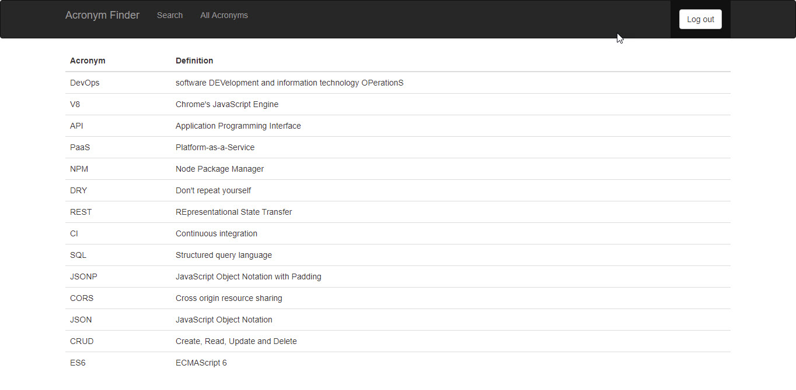

# Acronym Finder

Acronyms are everywhere in our lives. But what does each one stand for anyway? When does ATM mean "At The Moment" versus "Automated Teller Machine"? Simply put, the acronym definition depends on the given context. This project is intended to be an easy way to start a list for any context someone needs to record and find acronyms and their definitions.

Example of this project can be found here: https://www.matthewreed26.us

## Getting Started

I won't go into the specifics of installing mongoDB, Nodejs, or Reactjs. Please look at the package.json for running tests and starting the server. This project is meant to work in collaboration with https://github.com/matthewreed26/thinkful-node-capstone and can be used from the start without any data necessary as long as your mongoDB, this project, and the react one are all running simultaneously.

If you did want to bulk import a list of your own acronyms locally:
`mongoimport --db thinkful-acronym-finder --collection acronyms --drop --file <some-path>\TestAcronymList.json --jsonArray --port <dbport>`

or through mLab:
`mongoimport --db thinkful-acronym-finder --collection acronyms --drop --file <some-path>\TestAcronymList.json --jsonArray --host <dbprefix>.mlab.com --port <dbport> -u <dbuser> -p <dbpassword>`

or look more specifically at the documentation for [mongoimport](https://docs.mongodb.com/manual/reference/program/mongoimport/).

## API
api/acronyms[with one of the following]
* GET(/) - all acronyms
* GET(/id) - info for a specific acronym
* POST(/ with acronym, definition) - add a new acronym
* PUT(/id with acronym, definition) - modify an existing acronym
* DELETE(/id) - delete an existing acronym

## Built With

* The MERN-stack
* Test-Driven Development utilizing Mocha and Chai
* Builds and Deployment are done using Travis-CI
* Example hosted using mLab, Heroku, and Netlify

## Authors

* **Matthew Reed** - https://github.com/matthewreed26

## Acknowledgments

* Thinkful, Inc.
